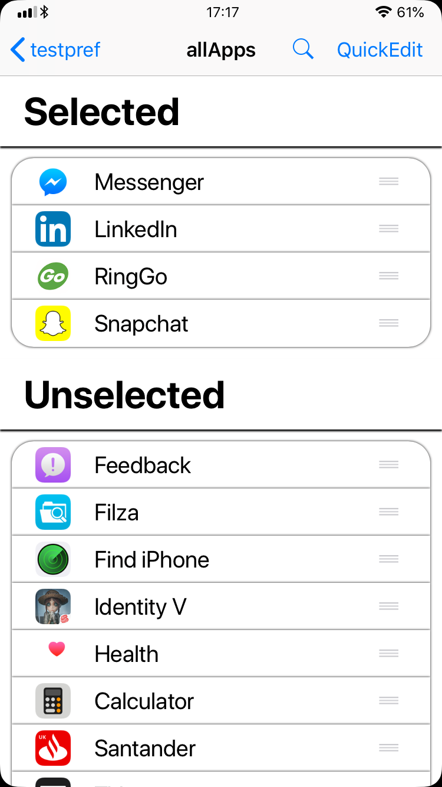
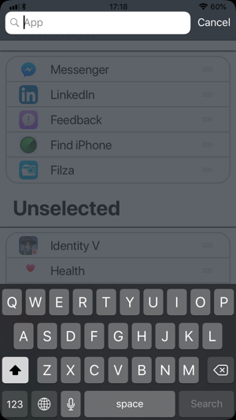

# KBAppList
Framework for access to lists of installed apps and cool app selection preference panes!

The preferences, unlike all other iOS preference panes makes use of a UICollectionView with a fresh but iOS like look rather then the standard UITableView.
It comes with drag and drop, quick edit, and search capabillities to improve user use within your tweaks.

Requires a unique ID key for saving the list in preferences, which can be retrieved in a number of ways. The recommended method is NSUserDefaults.
Can also take a Post Notification Key, to allow you to instantly retrieve the new listed of selected apps whenever a change to the selected apps is made.

|Downloads:| [Latest Release](https://github.com/kanesbetas/KBAppList/releases/latest) | [Headers](https://github.com/kanesbetas/KBAppList/tree/master/kbapplist/headers)  | [Example Use](https://github.com/kanesbetas/KBAppList/tree/master/kbapplist/Example)  | [Package](https://github.com/kanesbetas/KBAppList/tree/master/kbapplist/packages)  |
|----------|--------------------------|----------|----------|----------|

## Information

#### Tweak
| Available Lists | iOS 8- | iOS 9 | iOS 10 | iOS 11+ |
|--------------------------|----------|----------|--------|--------|
| All Apps                 | UNTESTED | UNTESTED | YES    | YES    |
| User Apps                | UNTESTED | UNTESTED | YES    | YES    |
| System Apps              | UNTESTED | UNTESTED | YES    | YES    |
| Audio Apps               | UNTESTED | UNTESTED | YES    | YES    |

---
#### Preferences
| Available Lists | iOS 8- | iOS 9 | iOS 10 | iOS 11+ |
|--------------------------|----------|----------|--------|--------|
| All Apps                 |    NO    | UNTESTED |  YES   |  YES   |
| User Apps                |    NO    | UNTESTED |  YES   |  YES   |
| System Apps              |    NO    | UNTESTED |  YES   |  YES   |
| Audio Apps               |    NO    | UNTESTED |  YES   |  YES   |

|        Keys        |    Option 1   |       Option 2      | Option 3 |  Option 4 |
|:------------------:|:-------------:|:-------------------:|:--------:|:---------:|
|   preferencesID   | UNIQUE STRING |                     |          |           |
|       default      |   "selected"  | "unselected" or nil |          |           |
| postNotificationID | UNIQUE STRING |         nil         |          |           |
|       appList      |   "userApps"  |     "systemApps"    | "allApps"|"audioApps"|
|        label       |     STRING    |         nil         |          |           |
| selectionAllowance |    INTEGER    |         nil         |          |           |

---

---
## License 
Please dont steel code!

This software is licensed under the BSD 4 License, detailed in the file [LICENSE.md](https://github.com/kanesbetas/KBAppList/blob/master/LICENSE.md)
If you do wish to use this code in your project then in addition to the License agreement you must also provide a link to my website https://kanebuckthorpe.co.uk. If for any reason you do not wish to include my website in your project, then please contact me so we can discuss another agreement.
